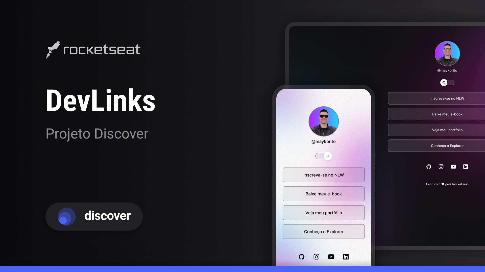

<<<<<<< HEAD
 

  |<a href="#knowledge"> Knowledge Acquired</a> | 
  <a href="#technologies">Technologies</a> | 
  <a href="#layout">Layout</a> |  

 

=======
<h1 align= "center">SOCIAL TREE</h1>

<a href="#knowledge">Knowledge Acquired</a> | 
<a href="#technologies">Technologies</a> | 
<a href="#layout">Layout</a> |

 

>>>>>>> d12dc698f421a3cf7ae868d97ecb8467b4c699f2

<h2 id="knowledge">📖 Knowledge Acquired</h2>

During the Discover Marathon, I learned how to create a social tree, a page used for retargeting, where you can use as a online business card.

<h2 id = "technologies">🚀 Technologies</h2>

This project was created by this technologies: 

- HTML
- CSS
- JavaScript

<h2 id = "layout">💻 Layout</h2>

You can access the layout of this project through<a href = "https://www.figma.com/file/wCfD0zZPxVwsyOLSwjynaK/DevLinks-%E2%80%A2-Projeto-Discover-(Community)?node-id=1437%3A191&mode=dev"> THIS LINK</a>.

